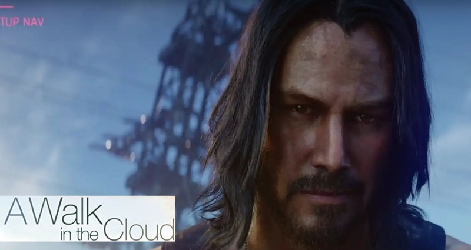

This years Electronic Entertainment Expo marks the current apex of a pretty questionable business model. EA has it for quite some time, Microsoft and Ubisoft are also joining in. The Netflix-Model, aka subscription-based services, are the latest craze and everybody wants to jump onto the train before the market is jaded. Meanwhile game streaming is re-entering the Gaming as a Service (GaaS) stage once again. With Stadia, xCloud and Orion, everybody wants their share. Promises are high: access the latest blockbuster titles on every device, keep your savegames synced and save money at the same time. 

But are gaming services capable of holding up to their promises? This is a critical review of subscription-based gaming services and game streaming.

<!-- end -->

# Gaming as a Service (GaaS)

EA has [Origin Access](https://www.origin.com/deu/de-de/store/origin-access), Ubisoft has [uPlay+](https://kotaku.com/everything-ubisoft-announced-at-e3-2019-1835383676), Microsoft announced the [Game Pass Ultimate](https://kotaku.com/everything-microsoft-announced-at-e3-2019-1835358411). Furthermore, [Stadia](https://stadia.dev/), [xCloud](https://www.gamesindustry.biz/articles/2019-06-09-xbox-adds-remote-play-style-console-streaming) and [Orion](https://www.polygon.com/e3/2019/6/10/18658799/orion-game-streaming-bethesda-id-software-doom) are launching soon. There is a recent trend in almost every business sector to switch from selling products towards selling a platform. When *Cloud Computing* started to become a growing market around 2010, this trend became inevitable. Everything was sold *as a Service (\*aaS)* back then. Today, the largest IT companies are making most of their sales in the cloud market. Google, Microsoft, Amazon, they all have drastically increased their cloud sales revenue over the last years. From a sales perspective, it is only logical to also the get cloud gaming business running.

Furthermore, cloud gaming services could be a way to tackle the Steam monopoly. For PC gaming, the Steam marketplace is so successful, that it is hard to even try to compete with it. Today, almost every publisher offers its own launcher, however, most of the games are still sold over Steam. Exclusive deals with Epic, for example, have only lead to negative publicity or shitstorms for developers. The endless mass of launchers has even made the [launcher launcher](https://www.youtube.com/watch?v=9n4JAhskw0k) become [reality](https://www.gogalaxy.com/en/).

## Subscription-Based Services

If you cannot win against Steam in selling games, you have to be creative. That's why large companies adapting what can be called the *Netflix Model*: instead of selling or leasing copies of products, simply sell a subscription that allows access to all your portfolio for a limited period of time. This model has become so successful that almost all of [Hollywoods Big 5](https://en.wikipedia.org/wiki/Major_film_studio#Present) are starting their own subscription-based platforms, directly competing with Netflix.

The business model has successfully been adapted by other booming industries: From Spotify and Audible to Adobe and Autodesk, everybody is boarding the subscription-train. Whilst subscription-based models have been standard for consoles (XBox Gold, PlayStation Plus), they haven't yet taken over PC gaming. However, this might change in the near future. This years E3 have seen multiple announcements of subscription services: Microsofts Game Pass Ultimate and uPlay+ will release to PC later this year and even Googles latest cloud innovation, [Stadia](https://gamedaily.biz/article/936/e3-2019-google-stadia-confirms-publisher-subscriptions-as-ubisoft-announces-uplay-) will provide a subscription service. The latter is especially interesting, because it provides another platform-oriented service: Game Streaming.

## Game Streaming

<small style="text-align: center;">Keanu Reeves will be streamed to your XBox soon. (CD Project RED, 20th Century Fox)</small>

Game streaming takes the subscription idea to a whole new level. Instead of renting a game for the sake of playing it, you subscribe to rent a whole gaming system alongside a selection of games and stream it to your local potato system. The idea is not exactly new, there are already some providers, which do work [somewhat](https://www.youtube.com/watch?v=eY_zjGAXs_8). However, now the big companies are entering the market: Microsofts xCloud, Googles Stadia and even id Softwares Orion. It appears that we are all streaming our games in the future. But should we?

## A Critical View on Gaming Services

The promise sounds too good to be true. Virtual consoles could solve the problem with console/PC exclusives: are we finally able to enjoy *Red Dead Redemption* on PC or the *Uncharted* series on XBox? Are we finally able to enjoy next-gen games without spending our precious savings on overpriced graphic cards1?

## The false Promise of Cross-Platform

I highly doubt it. To be fair: I think we will be able to stream console games to PC, but instead of fragmenting the player base by hardware, in a service-oriented world it will be fragmented by the different service providers. You enjoy playing *Forza Horizon* and *The Division*? 2 Maybe in the future you have to subscribe to xCloud/Game Pass **and** uPlay+.

The thing with exclusive deals, that even subscription-based models cannot solve is, that they are mostly exclusive for business reasons, not technical limitations. They are selling-points for hardware and will become selling-points for subscription providers. The advantage on the selling side is: You can sell two subscriptions to a user owning a console, while you can't sell him an exclusive title for another system.

There is also a point regarding console ports. There are [bad ports](https://kotaku.com/grand-theft-auto-iv-on-pc-is-a-little-broken-5101687) and [good ports](https://metro.co.uk/2015/04/14/gta-v-on-pc-launch-day-whats-new-and-whats-better-5148853/) 3. The first category is mostly bad due to cheap production or stupid restrictions. The example of GTA V shows, that good ports aren't just a waste of money but are worth the investment. With streaming, there should be virtually no costs connected to porting, but does this mean their overall quality will be better on each device?

## Multi-Device Games are Compromises

Probably not. Don't get me wrong, there might be games that work well on a variety of devices. In such cases, however, the costs associated with porting the title are already low. For all other games there are two options:

- A: Make a compromise and build the game around concepts that work on all supported devices.
- B: Adjust the game (e.g. input, graphics, ...) to work ideally (but differently) on all supported devices.

Option B is dismissed, since it is essentially what is done when porting a game to another device. The only advantage with cloud platforms in that case is, that developers can optimize the game engine to run on standardized machines, similar to consoles. However, this does not mean, that all cloud providers use the same hardware, nor that the game continues to work, if technology advances. 

Option A on the other hand implies, that you might have to sacrifice some features, because they do not work well on your smartphone or tablet (for example). As some of you know, two of my all-time favorite games are the GTA III era games, especially Vice City and San Andreas. Both games have gotten mobile ports for their 10th anniversary. And yes, I also played them. Well... I tried. While I am capable of doing pin-point precise maneuvers with both, controller and mouse/keyboard controls, I almost fractured my fingers even after hours of trying to [follow the goddamn train](https://www.youtube.com/watch?v=H1KTYqiQWoU). All because the game has never been developed with touch gestures in mind. Instead, it tries to emulate analog sticks, but fails to do so, since it naturally misses haptic feedback. The reality is: Not all devices are equally suited for all sorts of games.

Besides the fiddly handling, the fun didn't last very long. Running San Andreas drains my phone battery in about one hour at almost lowest graphical settings. Higher graphic settings heating it up to a degree that your hands are getting uncomfortably sweaty. Again, don't get me wrong, I love that Rockstar spent the time and effort of polishing and re-releasing the anniversary editions of my favorite games. However, after playing them for a while on my mobile, I simply started over on PC, where enjoy them much more.

## The Infrastructure Problem: No Network? No Fun!

For all those fancy promises there are not-so-fancy premises. I remember the shitstorm Valve got for requiring Steam as a DRM to be always connected to the internet in order to play Half Life 2, even in singleplayer mode. There are many other examples of this, even in recent times. Rightfully, because back in the day, if you'd buy a copy of a game on CD, you could do with it, whatever you wanted. You did not need an internet connection to play it at least in singleplayer. Why would you?

You might say that back then internet was slow and expensive, but this has changed. Well one thing I can say for sure is that you probably do not live in rural Germany. According to the [Broadband Atlas of the Federal Ministry of Transport and Digital Infrastructure](https://www.bmvi.de/SharedDocs/EN/publications/mid-2016-report-part-1-results.html), about 25% of all rural counties haven't even access to 16 Mbit/s! Even this is far from enough to support lossless FullHD streams with low latencies.

Regarding the aforementioned mobile gaming experience it gets even worse: Want to continue your console session to survive endless travels in the notoriously delayed trains of the *Deutsche Bahn*. Good luck, getting stable connections above GSM/Edge.

I know that those problems may be extreme here in Germany, but there's another point: Not only do you have to pay for subscriptions regularly, but also for your internet connection at home and your mobile provider. I don't know of many countries in Europe where you can get unlimited mobile data flatrates that are actually *affordable*. And lossless real-time FullHD streaming does take up a lot of data volume, not even speaking of higher display resolutions.

## Consumer Rights

But there are even more severe problems with game services. Even legal issues! 4

There is a legal difference between *buying* a product and *renting* it. Before there was Steam, you bought your games on physical mediums, which you actually did *own*. This has legal implications. If you own something, you are theoretically allowed to do whatever you want with it. Reselling it, copying it (at least for private purposes), modifying it, and so on. However, you cannot own non-physical (e.g. digital) copies of something. You can use a Steam download for as long as Steam allows you to, but you do not own it! If one day in the (hopefully far) future, Steam shuts down it takes all your gaming library with it.

With subscription based models, this may be simple. Remember the last time you wanted to watch a movie you were sure you put in your watchlist on Netflix and suddenly you couldn't find it anymore? Well that's because Netflix only has temporal rights to broadcast certain movies or series. The same might happen to game subscription services. Buy a hard copy of the game on the other hand and you will have access to it whenever you want, even in 20-30 years!

You might think, those problems arise because movies are licensed differently than software, but you are wrong. Features that got [patched away](https://www.reddit.com/r/linux/comments/bavayy/in_2008_i_bought_a_sony_ps3_for_entertainment_and/) or [subscription-software that is no longer usable due to legal issues](https://www.vice.com/en_us/article/a3xk3p/adobe-tells-users-they-can-get-sued-for-using-old-versions-of-photoshop) all have been there before. The question is: why should it be differently for video games?

Another argument is cost. Sure, most people are already paying for their internet connection anyway, so the extra cost for being able to play all those games is less, compared to buying them individually. I argue against this. As I said earlier, each provider wants its share of the cake and similar to consoles, exclusive deals are ideal to get users to use (i.e. pay for) their platform. As a user you can either not play exclusives that are not included in your subscription service, or you get the other subscription too. The ceiling for paying extra money is lowered - you might think twice or thrice about getting a PlayStation if you already own a XBox. In the end, its a large investment. But another $14.99 per moth sure doesn't hurt, does it? Suppose you spend $30 a month for game service subscriptions. That's $360 a year for a list of games you don't even own and which may be removed from your library before you finished them. Imagine how many games you could buy and actually own with this money! It may be subjective, but I'd rather spent $60 on a physical copy of a game I enjoy playing than paying monthly for the *possibility* to access thousands of games I am not even interested in.

There is one last thing I'd like to talk about: Cloud Computing is targeted at creative communities.

## The Cloud versus Communities

I've got a PC background. I love my desktop and never got used to consoles. I grew up in a time where the PC was the way to play games. Communities evolved around the games we played and loved. Most of the times, those communities were even a greater experience than the games themselves. A lot of my GTA nostalgia does not originate from the actual game, but rather from the countless mods I installed on it, until it crashed and I had to start over. It came from the people having ideas, participating and working together to achieve them. Modding has taught me a lot about computers, games and graphics and has been my door opener into a professional software developer career. 

Such communities gave something back to the game and even could hold up sales years after a games release. For example, after the [hot coffee](https://en.wikipedia.org/wiki/Hot_Coffee_mod) case, Rockstar did not punish all the modders with lawsuits, like they recently did with cheaters in GTA Online, exactly knowing that mods keep people playing (and buying) their games. Mods did enhance the game and [sometimes](http://www.worldofgothic.com/dl/?go=dlfile&fileid=166) made it playable in the first place. Surprisingly, it was a [mod](https://en.wikipedia.org/wiki/Counter-Strike) that lead to the acceptance and spread of Steam in the first place.

Such communities are [commonly](https://www.neoee.net/) also what keeps games running, after their official support lifecycle has ended. Older games would be long forgotten, if there were no emulators, no community patches and no enthusiasts with the possibility to create them. Maybe you haven't such strong ties to an old game from the 90's or 2000's, but many people do. In fact, for me it's what makes games more than just entertainment. Games are art, due to the creativity of their creators and how they used it to entertain you. Games are culture because of the enthusiastic people who form communities around a game. 

This holds true, as long as a game's only purpose becomes profit. Aren't communities today social media followers that you can feed with Double-XP events and special deals, countless DLC's and yearly releases? It makes perfectly sense for a [large publisher](https://www.youtube.com/watch?v=CRpkPvTkdUE) to move their games into the cloud. If you cannot mod your game to your custom preferences or use a trainer (for singleplayer, of course), you can sell those skins and booster packages even better. And the best: you don't even risk negative critics, because all those micro-transactions are optional. Game design shifts towards balancing grind and micro-transactions, in order to maximize profit.

## Conclusion

I do not want to impute game developers to have bad intentions or greed. This is not even close to what my intention with this post is. Game developers most of the times are given strict requirements. If their game needs to run in the cloud, because marketing is driving this new strategy, what are they supposed to do? 5 

This is more an appeal to gamers. Think twice before subscribing to a service. Think thrice if there is a limited-time offer or trial period. Those are only there to get you hooked and make you pay anyway. Played a few games for those free trial-months and don't want to waste your progress? Understandable, but that's how they hook you. And if you successfully started thinking critically about your decision to buy a video game, continue thinking critically about all your purchase decisions.

Because in the end it is not only a decision about *you* getting entertained 6, it is also about the people making those products and the conditions under which they are employed. And the game industry is not quite known for its fair working conditions.

Regarding subscription-based and cloud gaming. It might sound great at first glance, but think about what you actually expect from a game. Are you happy with yearly released open-world grinds? Than this whole deal might even pay out for you in the end. On the other hand, think about what you get from actually purchasing a game from a series you love as a physical disc instead of buying it on Steam. Who knows, maybe you even appreciate it more, having a nice artwork standing in your shelf.

Thank you for reading,\
Carsten. 

1 <small>Yes, I am talking about you nVidia!</small> \
2 <small>Those titles are just examples. We do not know yet, what titles the different subscriptions will cover.</small> \
3 <small>Examples taken intentionally.</small> \
4 <small>IanaL; this might be different for your country!</small> \
5 <small>Well, they could re-think this unionization thing and claim greater say in the production conditions of their work.</small> \
6 <small>warm, fed, dressed, transported, educated, ...</small>