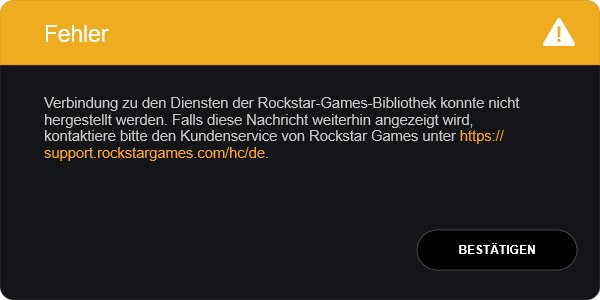

Tomorrow marks the day, the latest and long-awaited Rockstar Games title, Red Dead Redemption II will be released for Windows PC's. Along with it comes the requirement to install Rockstar's Game Launcher, which replaces the now obsolete Social Club application. Being a relatively young software product, the launcher is not free from issues. After I installed it, I ran into a reproducible connectivity problem. If you are also encountering such problems, you may give this solution a try!

<!-- end -->

# The Problem

[Rockstar's Game launcher](https://socialclub.rockstargames.com/rockstar-games-launcher) is the latest addition to the game launcher family, [we've all been waiting for](https://aschratt.github.io/devblog/game-pass-critic/). Unfortunately, after installing it, I wasn't able to get it running directly. I kept receiving the following error, directly after starting the application. The only options I had was to immediately close the app again.

> Connection to the Rockstar Games Library Service could not be established. In case you keep receiving this message, contact the customer support.

<small style="text-align: center;">The error message (in german).</small>

Rockstar's support website suggested to check the following requirements:

- Check if the Rockstar-Servers are working (they did)
- Check if the Router blocked connection (it didn't)
- Check if the Firewall allows communication through the UDP ports 6672 and 61455-61458 (it did)

I reached out to Rockstar Support and didn't receive an answer at first. After a few days, I was informed about a delay, due to the unusual number of requests. Understandable, a week before the launch of one of the best-selling games in video game history, yet another inconvenience caused by restrictive DRM.

# The Solution

First, I thought this was a networking issue and I think many people do, but after some debugging and research, it turned out that the *Rockstar Games Library Service* is actually a local Windows Service, the *Launcher* is connecting to. I tried starting it up manually and indeed, it refused to launch.

I checked the service installation and found that the installer did not register the service correctly in some cases. Services in Windows are registered under the registry key `HKEY_LOCAL_MACHINE\SYSTEM\CurrentControlSet\Services`. Each service has an `ImagePath`, that contains the directory of the executable assembly, Windows calls when launching a service. This assembly is invoked through the standard shell, which commonly refuses to resolve path names that contain white spaces or are installed on different drives/partitions. In order to deal with this problem, the shell needs to be told that the whole string actually contains just *one, whole* name. This is done by escaping the string with quotation marks.

# TL/DR - The Fix

There is a fool-proof and a proper fix. If you do not want (or are allowed) edit your registry files, your only option is to install the launcher to the default location (`C:\Program Files\Rockstar Games\Launcher\`).

The proper fix is actually trivial: Run `regedit.exe` to edit your registry. Browse to `HKEY_LOCAL_MACHINE\SYSTEM\CurrentControlSet\Services\Rockstar Service\` and edit the `ImagePath` property by putting quotation marks ("") around the value, just like in this example:

- Default: `D:\Program Files\Rockstar Games\Launcher\RockstarService.exe`
- Fixed: `"D:\Program Files\Rockstar Games\Launcher\RockstarService.exe"`

I've informed Rockstar Support about this fix and got an reply yesterday, where I was ensured that this will be fixed in future releases. Since I don't think that a patch will be available at launch day and I am surely not the only one with this problem, I wanted to share this with you, so that you are able to enjoy Rockstar's next masterpiece too.

Have fun!